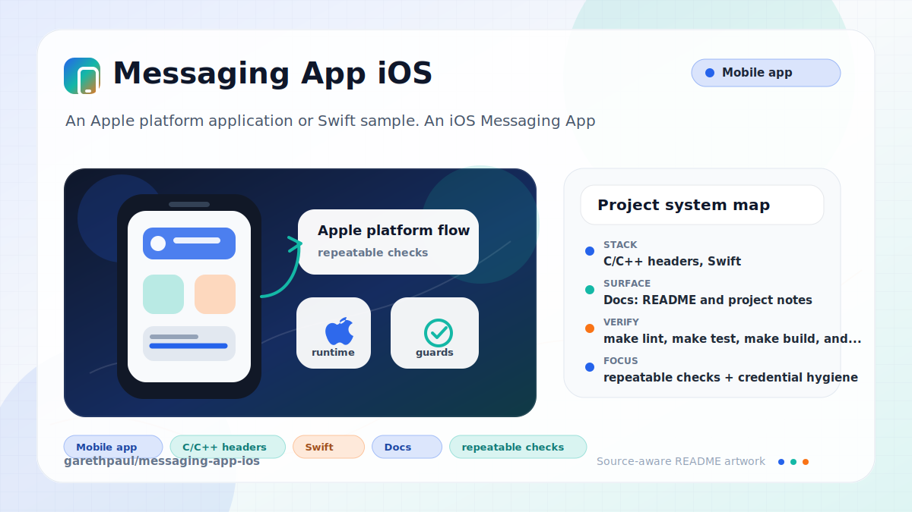

# messaging-app-ios

<!-- README-OVERVIEW-IMAGE -->


## Overview

`garethpaul/messaging-app-ios` is an Apple platform application or Swift sample. An iOS Messaging App 

This README is based on the checked-in source, manifests, scripts, and repository metadata on the `master` branch. The project language mix found during review was: C/C++ headers (118), Swift (27).

## Repository Contents

- `README.md` - project overview and local usage notes
- `CHANGES.md` - recent maintenance changes
- `Makefile` - local static verification entry point
- `Podfile` - Apple platform dependency metadata
- `Crashlytics.framework` - source or example code
- `DigitsKit.framework` - source or example code
- `Fabric.framework` - source or example code
- `Podfile.lock` - Apple platform dependency metadata
- `SECURITY.md` - security reporting and disclosure guidance
- `TwitterCore.framework` - source or example code
- `TwitterKit.framework` - source or example code
- `VISION.md` - project direction and maintenance guardrails
- `WhineLocation` - source or example code
- `WhineLocation.xcodeproj` - Xcode project file
- `scripts/check-baseline.py` - static credential and project wiring checks

Additional scan context:

- Source directories: Crashlytics.framework, DigitsKit.framework, Fabric.framework, TwitterCore.framework, TwitterKit.framework, WhineLocation, and 1 more
- Dependency and build manifests: Podfile, Podfile.lock
- Entry points or build surfaces: WhineLocation.xcodeproj
- Test-looking files: WhineLocationTests/WhineLocationTests.swift

## Getting Started

### Prerequisites

- Git
- Python 3 for static verification with `make check`
- macOS with Xcode for building Apple platform projects
- CocoaPods if dependencies need to be installed

### Setup

```bash
git clone https://github.com/garethpaul/messaging-app-ios.git
cd messaging-app-ios
make lint
make test
make build
make check
pod install
```

The setup commands above are derived from repository files. Legacy mobile, Python, or JavaScript samples may require older SDKs or package versions than a modern workstation uses by default.

## Running or Using the Project

- Open `WhineLocation.xcodeproj` in Xcode, choose the app or sample scheme, and run it on the matching simulator/device.
- Supply `FABRIC_API_KEY`, `CRASHLYTICS_BUILD_SECRET`, `TWITTER_CONSUMER_KEY`, and `TWITTER_CONSUMER_SECRET` through CI settings, local Xcode build settings, or an ignored xcconfig copied from `WhineLocation/ServiceKeys.xcconfig.example`.
- `WhineLocation/Info.plist` is tracked with placeholder-safe service keys and backend endpoint values; missing plist-backed values make `getInfo` return an empty value instead of force-unwrapping.
- Message read-state caching is keyed by the active Digits user and skips updates when the session or remote array shape is unavailable.
- Digits user ID normalization trims session IDs and skips blank values before message read-state storage changes.
- A Digits login success guard keeps failed authentication callbacks out of the partner flow and stores only normalized user IDs.
- The location share user guard skips location POSTs when no normalized Digits user ID is available.
- The new partner user guard skips partner requests when the partner number, normalized Digits user ID, or Digits session is unavailable.

## Testing and Verification

- `make lint`, `make test`, `make build`, and `make check` run
  `scripts/check-baseline.py`, which verifies project wiring, credential
  placeholders, `ServiceKeys.xcconfig.example`, plist lookup guardrails, the
  Digits login success guard, the new partner user guard, the location share
  user guard, and message read-state guards.
- Xcode's test action or `xcodebuild test` with the appropriate scheme and destination

When the required SDK or runtime is unavailable, use static checks and source review first, then verify on a machine that has the matching platform toolchain.

## Configuration and Secrets

- Detected references to Twitter. Keep API keys, OAuth credentials, tokens, and account-specific values in local configuration only.
- Keep `WhineLocation/Info.plist` tracked with placeholder-safe metadata and privacy usage descriptions.
- Do not commit Fabric API keys, Crashlytics build secrets, Parse credentials, signing material, message fixtures, phone identity data, or location data.
- Message read-state changes should preserve guarded Digits session lookup and array casts.
- Digits user ID normalization should continue to reject blank session IDs before writing local read-state data.
- The Digits login success guard should keep failed authentication callbacks from storing identity or opening the partner flow.
- The new partner user guard should keep partner requests behind normalized Digits session identities and nonblank partner numbers.
- The location share user guard should keep location POSTs behind normalized Digits session IDs.

## Security and Privacy Notes

- Review changes touching authentication or token handling; examples from the scan include Crashlytics.framework/Headers/Crashlytics.h, DigitsKit.framework/Headers/DGTAuthenticateButton.h, DigitsKit.framework/Headers/DGTContacts.h, DigitsKit.framework/Headers/DGTOAuthSigning.h, and 6 more.
- Review changes touching external API calls or credential-adjacent configuration; examples from the scan include Crashlytics.framework/Headers/Crashlytics.h, DigitsKit.framework/Headers/DGTAppearance.h, DigitsKit.framework/Headers/DGTAuthenticateButton.h, DigitsKit.framework/Headers/DGTContactAccessAuthorizationStatus.h, and 6 more.
- Review changes touching network requests, sockets, or service endpoints; examples from the scan include Podfile, TwitterCore.framework/Headers/TWTRAPIErrorCode.h, TwitterCore.framework/Headers/TWTRAuthConfig.h, TwitterCore.framework/Headers/TWTRCoreOAuthSigning.h, and 6 more.
- Review changes touching mobile permissions or privacy-sensitive device data; examples from the scan include DigitsKit.framework/Headers/DGTContactAccessAuthorizationStatus.h, DigitsKit.framework/Headers/DGTContacts.h, DigitsKit.framework/Headers/DGTContactsUploadResult.h, DigitsKit.framework/Headers/DGTErrors.h, and 6 more.
- Review changes touching file, media, JSON, XML, CSV, OCR, or data parsing; examples from the scan include DigitsKit.framework/Headers/DGTContacts.h, DigitsKit.framework/Headers/DGTContactsUploadResult.h, Podfile, TwitterCore.framework/Headers/TWTRConstants.h, and 6 more.
- Review changes touching database, model, or persistence code; examples from the scan include TwitterKit.framework/Headers/TWTRTweetTableViewCell.h, TwitterKit.framework/Headers/TWTRTweetViewDelegate.h, TwitterKit.framework/Versions/A/Headers/TWTRTweetTableViewCell.h, TwitterKit.framework/Versions/A/Headers/TWTRTweetViewDelegate.h, and 2 more.

## Maintenance Notes

- This looks like an Apple platform project or sample. Xcode, Swift, CocoaPods, and deployment target versions may need to match the original project era.
- Run `make lint`, `make test`, `make build`, and `make check` before pushing
  project, plist, credential, backend URL, Swift, or documentation changes.
- See `docs/plans/2026-06-09-make-gate-aliases.md` for the local gate alias
  baseline.
- See `SECURITY.md` for vulnerability reporting and safe research guidance.
- See `VISION.md` for project direction and contribution guardrails.

## Contributing

Keep changes small and tied to the project that is already present in this repository. For code changes, document the toolchain used, avoid committing generated dependency directories or local configuration, and update this README when setup or verification steps change.
